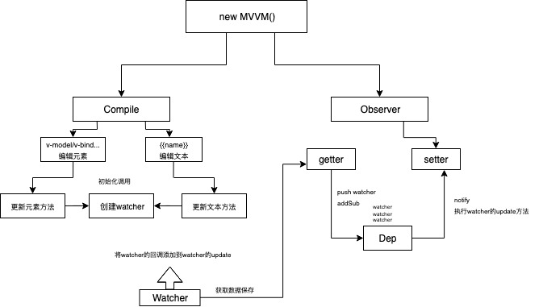

<!-- # 我的学习笔记 -->


<!-- ## [vue 原理分析](/vue/) -->

<!-- ## [vue 开发必知](/mustKnow/) -->

<!-- ## [H5 开发技巧](/h5Development/) -->
<!-- ## [CSS 文档](/cssModule) -->
<!-- ## [ASM.js](/ASM) -->
<!-- ## [面试](/面试) -->
## :ram: 虚拟列表

`虚拟列表`其实是按需显示的一种实现，即只对可见区域进行渲染，对非可见区域中的数据不渲染或部分渲染的技术，从而达到极高的渲染性能

假设有 1 万条记录需要同时渲染，我们屏幕的可见区域的高度为 500px，而列表项的高度为 50px,则此时我们在屏幕中最多智能看到 10 个列表项，那么在首次渲染的时候，我们只需要加载 10 条即可。
可查看项目 virtual-listview
[高性能渲染大数据Tree组件]
## :ram: MVVM的流程分析
在Vue的MVVM设计中，我们主要针对Compile（模板编译）、Observer（数据劫持）、Watcher（数据监听）和 Dep（发布订阅）几部分来实现


## :ram: 从多线程到 EventLoop 全面梳理

进程就好比工厂的车间，它代表 CPU 所能处理的单个任务。进程之间相互独立，任一时刻，CPU 总是运行一个进程，其他进程处于非运行状态。CPU 使用时间片轮进度算法来实现同时运行多个进程。
线程就好比车间里的工人，一个进程可以包括多个线程，多个线程共享进程资源

#### CPU、进程、线程之间的关系

- 进程 是 cpu 资源分配的最小单位（是能拥有资源和独立运行的最小单位）

* 线程 是 cpu 调度的最小单位（线程是建立在进程的基础上的一次程序运行单位，一个进程中可以有多个线程）
* 不同进程之间也可以通信，不过代价较大

- 单线程与多线程，都是指在一个进程内的单和多

#### 浏览器是多进程的

对于计算机来说，每一个应用程序都是一个进程，而每一个应用程序都会有很多的功能模块，这些功能模块实际上是通过子进程来实现的。对于这种子进程的扩展方式，我们可以称这个应用程序是多进程的。
而对于浏览器来说，浏览器就是多进程的，我在 Chrome 浏览器中打开了多个 tab，每个 tab 页，就是一个独立的进程

##### 浏览器包含了哪些进程

- 主进程
  - 协调控制其他子进程（创建、销毁）
  - 浏览器界面显示，用户交互，前进、后退、收藏
  - 将渲染进程得到的内存中的 Bitmap，绘制到用户界面上
  - 处理不可见操作，网络请求，文件访问等

* 第三方插件进程
  - 每种类型的插件对应一个进程，仅当使用该插件时才创建
* GPU 进程
  - 用于 3D 绘制等
* 渲染进程，就是我们说的浏览器内核

  - 负责页面渲染，脚本执行，事件处理等
  - 每个 tab 页一个渲染进程
    对于普通的前端操作来说，最重要的是渲染进程，也就是我们常说的浏览器内核

##### 浏览器内核（渲染进程）

渲染进程也是多线程的

- GUI 渲染线程
  - 负责渲染页面，布局和绘制
  - 页面需要重绘和回流时，该线程就会执行
  - 与 js 引擎线程互斥，防止渲染结果不可预期
- JS 引擎线程
  - 负责处理解析和执行 JavaScript 脚本程序
  - 只有一个 js 引擎线程（单线程）
  - 与 GUI 渲染线程互斥，防止渲染结果不可预期
- 定时触发器线程
  - setInterval 与 setTimeout 所在线程
  - 定时任务并不是由 js 引擎计时的，是由定时触发线程来计时的
  - 计时完毕后，通知事件触发线程
- 异步 http 请求线程
  - 浏览器有一个单独的线程用于处理 AJAX 请求
  - 当请求完成时，若有回调函数，通知事件触发线程

##### 为什么 JavaScript 是单线程的

在创建 JavaScript 这门语言时，多进程多线程的架构并不流行，硬件支持不好。
其次是因为多线程的复杂性，多线程操作需要加锁，编码的复杂性会增高
而且，如果同时操作 DOM，在多线程不加锁的情况下最终会导致 DOM 渲染的结果不可预期

##### 为什么 GUI 渲染线程与 JS 引擎线程互斥

这是由于 js 是可以操作 DOM 的，如果同时修改元素属性并同时渲染界面（即 JS 线程和 UI 线程同时运行），那么渲染线程前后获得的元素就可能不一致了。
因此，为了防止渲染出现不可预期的结果，浏览器设定 GUI 渲染线程和 JS 引擎线程为互斥关系，当 JS 引擎线程执行时 GUI 渲染线程会被挂起，GUI 更新则会被保存在一个队列中等待 JS 引擎线程空闲时立即被执行。

#### 从 Event Loop 看 JS 的运行机制

概念：

- JS 分为同步任务和异步任务
- 同步任务都在 JS 引擎线程上执行，形成一个执行栈
- 事件触发线程管理一个任务队列，异步任务触发条件达成，将回调事件放到任务队列中
- 执行栈中所有同步任务执行完毕，此时 js 引擎线程空闲，系统会读取任务队列，将可运行的异步任务回调事件添加到执行栈中，开始执行

#### 运行 setTimeout、setInterval、XHR、fetch

当代码执行到 setTimeout/setInterval 时，实际上是 JS 引擎线程通知定时触发器线程，间隔一个时间后，会触发一个回调事件，而定时触发器线程在接收到这个消息后，会在等待的时间后，将回调事件放入到由事件触发线程所管理的事件队列中。

当代码执行到 XHR/fetch 时，实际上是 JS 引擎线程通知异步 http 请求线程，发送一个网络请求，并制定请求完成后的回调事件，而异步 http 请求线程在接收到这个消息后，会在请求成功后，将回调事件放入到由事件触发线程所管理的事件队列中。

当我们的同步任务执行完，JS 引擎线程会询问事件触发线程，在事件队列中是否有待执行的回调函数，如果有就会加入到执行栈中交给 JS 引擎线程执行

总结：

- JS 引擎线程只执行执行栈中的事件
- 执行栈中的代码执行完毕，就会读取事件队列中的事件
- 事件队列中的回调事件，是由各自线程插入到事件队列中的
- 如此循环

## :ram: Generator 函数暂停恢复执行原理

<!-- ## [IndexedDB](/indexedDB) -->

::: tip
一个线程（或函数）执行到一半，可以暂停执行，将执行权交给另一个线程（或函数），等到稍后收回执行权的时候，再恢复执行。这种可以并行执行、交换执行权的线程（或函数），就称为协成。
:::
协程是一种比线程更加轻量级的存在。普通线程是抢先式的，会争夺 cpu 资源，而协程是合作的，可以把协程看成是跑在线程上的任务，一个线程上可以存在多个协程，但是在线程上同时只能执行一个协程。

- 1.协程 A 开始执行
- 2.协程 A 执行到某个阶段，进入暂停，执行权转移到协程 B
- 3.协程 B 执行完成或暂停，将执行权交还 A
- 4.协程 A 恢复执行
  协程遇到`yield命令`就暂停，等到执行权返回，再从暂停的地方继续往后执行。它的最大优点，就是代码的写法非常像同步操作，如果去除 yield 命令，简直一模一样。

#### 执行器

通常，我们把执行生成器的代码封装成一个函数，并把这个执行生成器代码的函数称为执行器，`co模块`就是一个著名的执行器
Generator 是一个异步操作的容器。它的自动执行需要一种机制，当异步操作有了结果，能够自动交回执行权。两种方法可以做到这一点：

- 1.回调函数。将异步操作包装成 Thunk 函数，在回调函数里面交回执行权
- 2.Promise 对象。将异步操作包装成 Promise 对象，用 then 方法交回执行权
  一个基于 Promise 对象的简单自动执行器

```js
function run(gen) {
  var g = gen();
  function next(data) {
    var result = g.next(data);
    if (result.done) return result.value;
    result.value.then(function(data) {
      next(data);
    });
  }
  next();
}
// 使用
function* foo() {
  let response1 = yield fetch('https://xxx'); // 返回promise对象
  console.log('response1');
  console.log(response1);
  let response2 = yield fetch('https://xxx');
  console.log('response2');
  console.log(response2);
}
run(foo);
```

上面代码中，只要 Generator 函数还没执行到最后异步，next 函数就调用自身，以此实现自动执行。通过使用生成器配合执行器，就能实现使用同步的方式写出异步代码了，这样也加强了代码的可读性。

## :ram: async/await

ES7 中引入了 async/await，这种方式能够彻底告别执行器和生成器，实现更加直观简洁的代码。根据 MDN 定义，async 是一个通过异步执行并隐式返回 Promise 作为结果的函数。可以说 async 是 Generator 函数的语法糖，并对 Generator 函数进行了改进
前文中的代码，用 async 实现是这样：

```js
const foo = async () => {
  let response1 = await fetch('https://xxx');
  console.log('response1');
  console.log(response1);
  let response2 = await fetch('https://xxx');
  console.log('response2');
  console.log(response2);
};
```

async 函数对 Generator 函数的改进，体现在以下四点：

- 1.内置执行器。Generator 函数的执行必须依靠执行器，而 async 函数自带执行器，无需手动执行 next() 方法。
- 2.更好的语义。async 和 await，比起星号和 yield，语义更清楚了。async 表示函数里有异步操作，await 表示紧跟在后面的表达式需要等待结果。
- 3.更广的适用性。co 模块约定，yield 命令后面只能是 Thunk 函数或 Promise 对象，而 async 函数的 await 命令后面，可以是 Promise 对象和原始类型的值（数值、字符串和布尔值，但这时会自动转成立即 resolved 的 Promise 对象）。
- 4.返回值是 Promise。async 函数返回值是 Promise 对象，比 Generator 函数返回的 Iterator 对象方便，可以直接使用 then() 方法进行调用。

## :ram: 实现高难度加载、吸顶、触底

`IntersectionObserver`接口，提供了一种异步观察 目标元素与其祖先元素或顶级文档视窗（viewport）交叉状态的方法，祖先元素与视窗（viewport）被称为根（root）；
`IntersectionObserver`翻译为『交叉观察者』，它的任务就是监听目标元素跟指定父元素（用户可指定，默认为 viewport）是否在发生交叉行为，简单理解就是监听目标元素是否进入或者离开了指定父元素的内部

#### 1.构造函数

```js
new IntersectionObserver(callback, options);
```

#### 2.callback

发生交叉的回调，接受一个 entries 参数，返回当前已监听并且发生了交叉的目标集合

```js
new IntersectionObserver(entries => {
  entries.forEach(item => console.log(item));
});
```

item 里面包含哪些常用属性
属性 | 说明  
-|-
boundingClientRect | 空间信息 |
intersectionRatio | 元素可见区域的占比 |
isIntersecting | 字面理解为是否正在交叉，可用做判断元素是否可见 |
target | 目标节点，就跟 event.target 一样 |
注意：页面初始化的时候会触发一次 callback，entries 为所有已监听的目标集合

#### 3.options

| 属性       | 说明                                                                                  |
| ---------- | ------------------------------------------------------------------------------------- |
| root       | 指定父元素，默认为视窗                                                                |
| rootMargin | 触发交叉的偏移值，默认为『0px 0px 0px 0px』(上左下右，正数为向外扩散，负数则向内收缩) |

如果设置 rootMargin 为『20px 0px 30px 30px』,那么元素未达到视窗时，就已经切换为可见状态了

#### 4.常用方法

| 名称        | 说明                       | 参数 |
| ----------- | -------------------------- | ---- |
| observe     | 开始监听一个目标元素       | 节点 |
| unobserve   | 停止监听一个目标元素       | 节点 |
| takeRecords | 返回所有监听的目标元素结合 |      |
| disconnect  | 停止所有监听               |      |

### 02 简单例子

1.假设页面上有一个 class="box"的盒子且父元素为视窗

```js
let box = document.querySelector('.box');
let observer = new IntersectionObserver(entries => {
  entries.forEach(item => {
    let tips = item.isIntersecting
      ? '进入了父元素的内部'
      : '离开了父元素的内部';
    console.log(tips);
  });
});
observer.observe(box); // 监听一个box
```

2.假设页面上有多个 class="box"的盒子且父元素为视窗：

```js
let box = document.querySelectorAll('.box');
let observer = new IntersectionObserver(entries =>
  console.log(`发生交叉行为，目标元素有${entries.length}个`)
);
box.forEach(item => observer.observe(item)); // 监听多个box
```

3.指定父元素
假设 html 如下

```js
<div class="parent">
  <div class="child"></div>
</div>;
// 开始监听
let child = document.querySelector('.child');
let observer = new IntersectionObserver(
  entries => {
    entries.forEach(item => {
      console.log(item.isIntersecting ? '可见' : '不可见');
    });
  },
  {
    root: document.querySelector('.parent')
  }
);
observer.observe(child); // 开始监听child
```

### 03 实际应用

1.图片懒加载
以前都是监听浏览器滚动，然后遍历拿到每个图片的空间信息，然后判断一些位置信息从而进行图片加载；而现在只需要交给交叉观察者去做

```js
let images = document.querySelectorAll('img.lazyload');
let observer = new IntersectionObserver(entries => {
  entries.forEach(item => {
    if (item.isIntersecting) {
      item.target.src = item.target.dataset.origin; // 开始加载图片
      observer.unobserve(item.target); // 停止监听已开始加载的图片
    }
  });
});
images.forEach(item => observer.observe(item));
```

2.触底
我们在列表底部放一个参照元素，然后让交叉观察者去监听；

```js
// 数据列表
<ul>
  <li>index</li>    // 多个 li
</ul>
// 参照元素
<div class="reference"></div>

new IntersectionObserver(entries => {
  let item = entries[0];  // 拿第一个就行，反正只有一个
  if(item.isIntersecting) console.log("滚动到了底部，开始请求数据");
}).observe(document.querySelector(".reference"));  // 监听参照元素
```

3.吸顶
实现元素吸顶的方式有很多种，如 css 的 position:sticky,兼容性较差；如果用交叉观察者实现也很方便，同样也要发一个参照元素

```js
<ul>
  <li></li>    // 多个li
</ul>
// scss
ul {
  li {
    &.show {
      // 默认从左边进来
      animation: left 1s ease;
      // 偶数从右边进来
      &:nth-child(2n){
        animation: right 1s ease;
      }
    }
  }
}
@keyframes left {
  from {
    opacity: 0;
    transform: translate(-20px,20px); // right动画改成20px，20px即可
  }
  to {
    opacity: 1
  }
}

// 监听
let list = document.querySelectorAll("ul li");
let observer = new IntersectionObserver(entries => {
  entries.forEach(item => {
    if(item.isIntersecting){
      item.target.classList.add('show'); // 增加show类名
      observer.unobserve(item.target);   // 移除监听
    }
  })
})
list.forEach(item => observer.observe(item));
```
